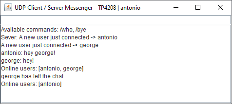

<h3 align="center">UDP Server / Client Messenger (with GUI) written in Java using Sockets</h3>  

  ## Languages and Tools
  

## Usage
Just import the project folder to NetBeans or your preference editor and start the Server. 
After that, to run the program please start the server and then start a client/s. There's no need to pass any arguments as everything needed must be entered from the user through the GUI.

// The program is getting the server IP automatically if server and client/s are running on the same PC
 // Available commands: 
* /who -> showing the connected users
* /bye -> disconnects and terminates the thread

## Screenshots

<h5>Tags</h5>
java, udp, client, server, chat, messenger, multiple users, gui, ui, user interface
